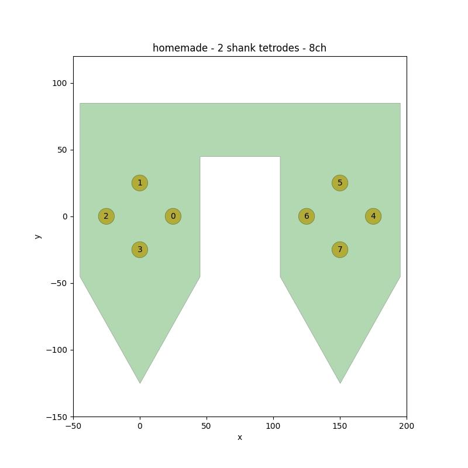

Format specifications
=====================

With :code:`probeinterface` we introduce a simple format based on the JSON format.
The format is a trivial json-serialisation of a Python
dictionary. The dictionary maps every
attribute of the Probe class.

In fact, the format itself describes a ProbeGroup, so it can include several probes.
The format can describe a simple unique probe with its geometry and wiring, as well as a full experimental setup
with several probes and their wiring to the recording device.

Here is a description of the fields in the json file.

Let's imagine we want to describe a probe with:
  * 8 channels
  * 2 shanks (one tetrode on each shank)

The first part contains fields about the :code:`probeinterface` version
and a list of probes::

  {
    "specification": "probeinterface",
    "version": "0.1.0",
    "probes": [
      {
        ...
      }
    ]
  }

Then each probe will be a sub-dictionary in the :code:`probes` list::

        {
            "ndim": 2,
            "si_units": "um",
            "annotations": {
                "name": "2 shank tetrodes",
                "manufacturer": "homemade"
            },
            "contact_positions": [
        ...

The probe dictionary contains all necessary fields and optional fields.

Necessary:
  * ndim
  * si_units
  * annotations
  * contact_positions
  * contact_shapes
  * contact_shape_params

Optional:
  * contact_plane_axes
  * probe_planar_contour
  * device_channel_indices
  * shank_ids

An example of a full json file:

.. include:: probe_format_example.json
    :code: json
