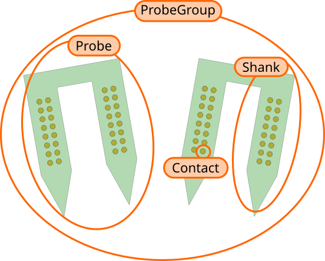

Probeinterface: a unified framework for probe handling in neuroscience
======================================================================

:code:`probeinterface` is Python package to handle probe layout, geometry and wiring to device for neuroscience experiments.

The package handles the following items:

  * probe geometry (2D or 3D  layout)
  * probe shape (contour of the probe)
  * shape and size of the s
  * probe wiring to the recording device
  * combination of several probes: global geometry + global wiring

The :code:`probeinterface` package also provide:

  * basic plotting functions with matplotlib
  * input/output functions to several formats (PRB, NWB, CSV, MEArec, SpikeGLX, ...)

Here a schema for the naming used in the package:  

  
.. include:: examples/index.rst
   
.. toctree::
   :caption: Contents:
   :maxdepth: 1
   
   overview
   examples/index.rst
   format_spec
   library
   api
   release_notes
